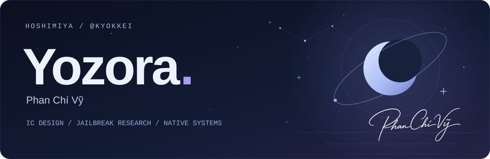
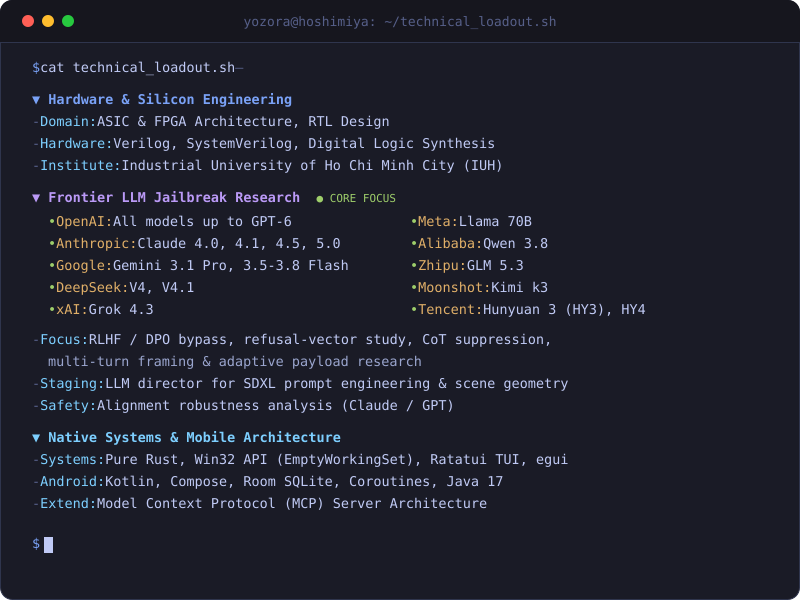

<div align="center">

<a href="https://hoshimiya.dev">
  
</a>

**[Website ↗](https://hoshimiya.dev)** &nbsp; / &nbsp; **[Projects](#selected-projects)** &nbsp; / &nbsp; **[Technical loadout](#technical-loadout)** &nbsp; / &nbsp; **[Say hello](mailto:kyokkei@hoshimiya.dev)**

</div>

## Yahallo, I'm Yozora.

**Phan Chí Vỹ / `@Kyokkei`** · IC Design student at **IUH** (Industrial University of Ho Chi Minh City).

Silicon by day. Frontier AI jailbreak research and native systems by night. I break safety alignments, build zero-telemetry utilities, and engineer applications that put control in the user's hands.

`Rust` &nbsp; `Kotlin` &nbsp; `Java` &nbsp; `Verilog` &nbsp; `SystemVerilog` &nbsp; `MCP`

---

## Selected projects

### 01 / [Zora.AI ↗](https://github.com/Kyokkei/Zora.AI)

**A native Android AI companion. Your API, your rules.**

Real-time duplex voice, unrestricted persona customization, gyro-parallax visuals, and encrypted local storage. Built with direct device-to-model routing and zero telemetry.

`Kotlin` · `Jetpack Compose` · `Room` · `Gemini Live`

[](https://github.com/Kyokkei/Zora.AI/releases/latest) &nbsp; [Explore the app →](https://github.com/Kyokkei/Zora.AI#-interface-showcase)

### 02 / [Fukidashi MCP ↗](https://github.com/Kyokkei/fukidashi-mcp)

**A local manga localization studio for AI agents.**

Offline vision, OCR, LaMa inpainting, and smart typesetting, connected through MCP. Review the result in a native QA editor before export.

`Rust` · `MCP` · `RT-DETR` · `LaMa` · `egui`

[](https://github.com/Kyokkei/fukidashi-mcp/releases/latest) &nbsp; [See the pipeline →](https://github.com/Kyokkei/fukidashi-mcp#-demo-pipeline)

### Also in orbit

| Project | What it does | Built with |
| :--- | :--- | :--- |
| **[RamNuker](https://github.com/Kyokkei/RamNuker)** | Windows working-set RAM purger with a terminal UI and scheduled automation. | Rust · Win32 · Ratatui |
| **[ProjectBeta](https://github.com/Kyokkei/ProjectBeta)** | Gamified digital discipline with BetaToken economics, loot cases, and an AI Keyholder. | Kotlin · Android |
| **[SekaiTimer](https://github.com/Kyokkei/SekaiTimer)** | Project SEKAI event tracking in an Android widget, with a native MediaWiki parser. | Java 17 · Zero dependencies |

**Research notes:** [AI models, IDEs, and jailbreak evaluations →](https://github.com/Kyokkei/AI-evaluation-report-2026)

---

## Technical loadout

- **Silicon:** ASIC & FPGA architecture, RTL design, Verilog / SystemVerilog, and digital logic synthesis.
- **Frontier AI jailbreak research:** RLHF / DPO bypass, refusal-vector study, CoT suppression, multi-turn framing, and alignment robustness analysis. LLM-directed SDXL prompt engineering and scene geometry.
- **Native systems:** Rust, Win32, Ratatui, egui, Kotlin / Compose, Room, coroutines, Java, and MCP server architecture.

<div align="center">
  
</div>

<details>
<summary><b>Open the full loadout · plain text / screen readers</b></summary>

```yaml
Hardware & Silicon Engineering:
  - Domain: ASIC & FPGA Architecture, RTL Design
  - Hardware: Verilog, SystemVerilog, Digital Logic Synthesis
  - Institute: Industrial University of Ho Chi Minh City (IUH)

Frontier LLM Jailbreak Research:
  - OpenAI: All legacy & modern models up to GPT-6
  - Anthropic: Claude 4.0, 4.1, 4.5, 5.0
  - Google: Gemini 3.1 Pro, 3.5, 3.6, 3.7, 3.8 Flash
  - DeepSeek: DeepSeek-V4, DeepSeek-V4.1
  - xAI: Grok 4.3
  - Meta: Llama 70B
  - Alibaba: Qwen 3.8
  - Zhipu AI: GLM 5.3
  - Moonshot AI: Kimi k3
  - Tencent: Hunyuan 3 (HY3), Hunyuan 4 (HY4)
  - Focus: RLHF / DPO bypass, refusal-vector study, CoT suppression, multi-turn framing
  - Staging: LLM director for SDXL prompt engineering & scene geometry
  - Safety: Alignment robustness analysis (Claude / GPT)

Native Systems & Mobile Architecture:
  - Systems: Pure Rust, Win32 API (EmptyWorkingSet), Ratatui TUI, egui GUI
  - Android: Native Kotlin, Jetpack Compose, Room SQLite, Coroutines, Pure Java 17
  - Extensibility: Model Context Protocol (MCP) Server Architecture
```
</details>

---

<div align="center">

*"In the abyss of night, a single star remains — burning through the dark, defiant."*

**[hoshimiya.dev ↗](https://hoshimiya.dev)** &nbsp;·&nbsp; **[kyokkei@hoshimiya.dev](mailto:kyokkei@hoshimiya.dev)** &nbsp;·&nbsp; **Discord** `kei_akashi.`

</div>

<details>
<summary>A line I live by</summary>

> *"To live is to risk it all otherwise you're just an inert chunk of randomly assembled molecules drifting wherever the universe blows you."* — Rick Sanchez

</details>
